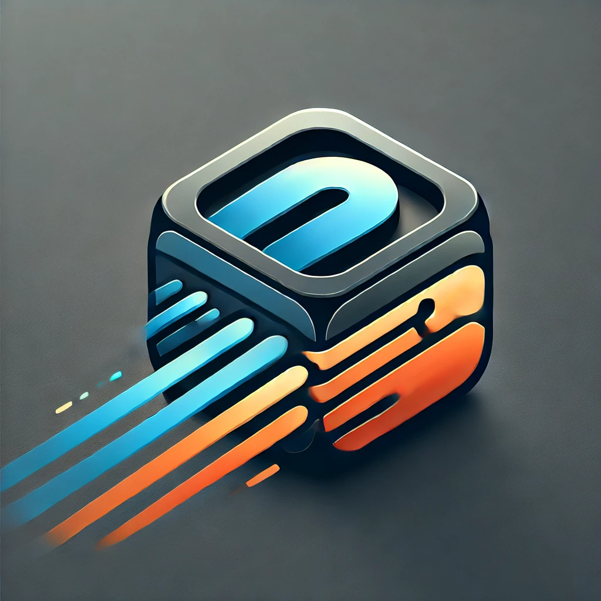

# 🚀 Gravity Runner

**Gravity Runner** is a fast-paced **2D endless runner** Android game built with Unity. Designed with intuitive one-touch controls and dynamic gravity-switching mechanics, it challenges players to react quickly, avoid obstacles, and collect stars to achieve high scores.

---
### App Logo

## 🎮 Gameplay Features

- **Endless Runner Mechanics**: Run endlessly through an ever-changing course filled with deadly obstacles.
- **Gravity Switch**: Tap the **left side** of the screen to flip gravity and run on the ceiling!
- **Jump Mechanic**: Tap the **right side** of the screen to jump over obstacles.
- **Collectibles**: Grab stars as coins to boost your score.
- **Dynamic Obstacles**: Avoid spikes, moving platforms, and tricky terrain that require fast reflexes.
- **Sound & Music**: Engaging background music and sound effects for actions like jumping and collecting stars.
- **Settings Menu**: In-game options for controlling music, sound effects, and basic game settings.

---

## 📱 Platform

- Developed for **Android**
- Built using **Unity Engine (2D)**

---

## 🎨 Controls

| Input              | Action            |
|--------------------|-------------------|
| Tap Left Side      | Switch Gravity    |
| Tap Right Side     | Jump              |

### Switch Gravity :

### Jump :

---

## 🛠️ Technologies Used

- **Unity 2D** for game development
- **C#** for scripting player controls, physics, and UI
- **Unity Animator** for smooth character movement and effects
- **AudioManager** for background music and in-game sound effects

